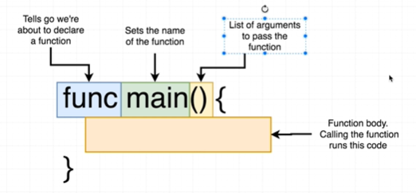
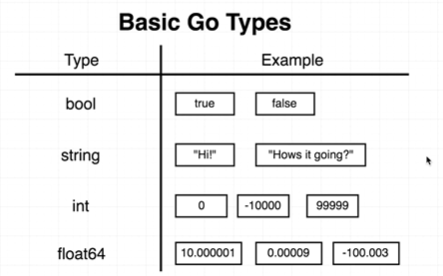
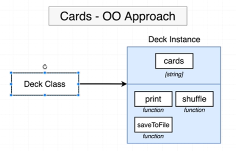

## Introduction
Keep sample code and note from practice of udemy course https://www.udemy.com/course/go-the-complete-developers-guide/

## Section1 - Getting Started

### Environment Setup
([course link](https://www.udemy.com/course/go-the-complete-developers-guide/learn/lecture/7797236#overview)) Please follow the course to prepare the Go runtime and development environment. To make sure your go is ready to go, try command below:
```console
# go version
go version go1.13.4 linux/amd64
```

## Section2 - A Simple Start 

### Boring OI'Hello World
([course link](https://www.udemy.com/course/go-the-complete-developers-guide/learn/lecture/7797244#overview))

### Five Important Questions
([course link](https://www.udemy.com/course/go-the-complete-developers-guide/learn/lecture/7797246#overview))<br/>
Five questions to ask about:
* How do we run the code in our project?
* What does `package main` mean?
* What does `import "fmt"` mean?
* What's that `func` thing?
* How is the `main.go` file organized?

To run `main.go` by command below:
```console
// Make sure you have main.go under below path
# pwd
/github_root/udemy_golang_developer_guide/code/helloworld

# go run main.go
Hi there
```

Basically, the Go support commands as below ([more](https://golang.org/cmd/)):
</br>

<br/>
So we can build tne file `main.go` and produce executable file `main` as below:
```console
# go build main.go
# ls
main  main.go

# ./main
Hi there
```
### Go Packages
([course link](https://www.udemy.com/course/go-the-complete-developers-guide/learn/lecture/7797248#overview)) <br/>

### Import Statements
([course link](https://www.udemy.com/course/go-the-complete-developers-guide/learn/lecture/7797250#overview)) <br/>
For public and supported packages from you, check [this page](https://golang.org/pkg/).

### File Organization
([course link](https://www.udemy.com/course/go-the-complete-developers-guide/learn/lecture/7797252#overview)) <br/>
`func` is a keyword to define a function:<br/>

<br/>

## Section3 - Deeper into Go


### Project Overview
([course link](https://www.udemy.com/course/go-the-complete-developers-guide/learn/lecture/7797262#overview)) <br/>

<br/>


### New Project Folder
([course link](https://www.udemy.com/course/go-the-complete-developers-guide/learn/lecture/7797266#overview)) <br/>

### Variable Declarations
([course link](https://www.udemy.com/course/go-the-complete-developers-guide/learn/lecture/7797268#overview)) <br/>

<br/>
From Go, we have below basic data types ([tour golang - basic types](https://tour.golang.org/basics/11)): <br/>

<br/>

### Functions and Return types
([course link](https://www.udemy.com/course/go-the-complete-developers-guide/learn/lecture/7797272#overview)) <br/>

<br/>
One function declaration example:
```go
func newCard() string {
    return "Five of Diamonds"
}
```

### Slices and For loops
([course link](https://www.udemy.com/course/go-the-complete-developers-guide/learn/lecture/7797274#overview)) <br/>

<br/>

The syntax of range ([tutorialspoint - Go - Range](https://www.tutorialspoint.com/go/go_range.htm)):

<br/>

### OO Approach vs Go Approach
([course link](https://www.udemy.com/course/go-the-complete-developers-guide/learn/lecture/7797276#overview)) <br/>
For OO approach, it might look like: <br/>

<br/>

For Go approach, one possible solution:

<br/>
So our project file structure may look like:

<br/>
