## Introduction
Keep sample code and note from practice of udemy course https://www.udemy.com/course/go-the-complete-developers-guide/

* **[Section1 - Getting Started](#s1)**
* **[Section2 - A Simple Start ](#s2)**
* **[Section3 - Deeper into Go](#s3)**
* **[Section4 - Organizing Data With Structs](#s4)**
* **[Section5 - Maps](#s5)**
* **[Section6 - Interfaces](#s6)**

<a id='s1'></a>
## Section1 - Getting Started

### Environment Setup
([course link](https://www.udemy.com/course/go-the-complete-developers-guide/learn/lecture/7797236#overview)) Please follow the course to prepare the Go runtime and development environment. To make sure your go is ready to go, try command below:
```console
# go version
go version go1.13.4 linux/amd64
```

<a id='s2'></a>
## Section2 - A Simple Start 

### Boring OI'Hello World
([course link](https://www.udemy.com/course/go-the-complete-developers-guide/learn/lecture/7797244#overview))

### Five Important Questions
([course link](https://www.udemy.com/course/go-the-complete-developers-guide/learn/lecture/7797246#overview))<br/>
Five questions to ask about:
* How do we run the code in our project?
* What does `package main` mean?
* What does `import "fmt"` mean?
* What's that `func` thing?
* How is the `main.go` file organized?

To run `main.go` by command below:
```console
// Make sure you have main.go under below path
# pwd
/github_root/udemy_golang_developer_guide/code/helloworld

# go run main.go
Hi there
```

Basically, the Go support commands as below ([more](https://golang.org/cmd/)):
</br>

<br/>
So we can build tne file `main.go` and produce executable file `main` as below:
```console
# go build main.go
# ls
main  main.go

# ./main
Hi there
```
### Go Packages
([course link](https://www.udemy.com/course/go-the-complete-developers-guide/learn/lecture/7797248#overview)) <br/>

### Import Statements
([course link](https://www.udemy.com/course/go-the-complete-developers-guide/learn/lecture/7797250#overview)) <br/>
For public and supported packages from you, check [this page](https://golang.org/pkg/).

### File Organization
([course link](https://www.udemy.com/course/go-the-complete-developers-guide/learn/lecture/7797252#overview)) <br/>
`func` is a keyword to define a function:<br/>

<br/>

<a id='s3'></a>
## Section3 - Deeper into Go


### Project Overview
([course link](https://www.udemy.com/course/go-the-complete-developers-guide/learn/lecture/7797262#overview)) <br/>

<br/>

### New Project Folder
([course link](https://www.udemy.com/course/go-the-complete-developers-guide/learn/lecture/7797266#overview)) <br/>
We are going to create a project `deck` here to learn Golang here. <br/>

### Variable Declarations
([course link](https://www.udemy.com/course/go-the-complete-developers-guide/learn/lecture/7797268#overview)) <br/>

<br/>
From Go, we have below basic data types ([tour golang - basic types](https://tour.golang.org/basics/11)): <br/>

<br/>

### Functions and Return types
([course link](https://www.udemy.com/course/go-the-complete-developers-guide/learn/lecture/7797272#overview)) <br/>

<br/>
One function declaration example:
```go
func newCard() string {
    return "Five of Diamonds"
}
```

### Slices and For loops
([course link](https://www.udemy.com/course/go-the-complete-developers-guide/learn/lecture/7797274#overview)) <br/>

<br/>

The syntax of range ([tutorialspoint - Go - Range](https://www.tutorialspoint.com/go/go_range.htm)): <br/>

<br/>

### OO Approach vs Go Approach
([course link](https://www.udemy.com/course/go-the-complete-developers-guide/learn/lecture/7797276#overview)) <br/>
For OO approach, it might look like: <br/>

<br/>

For Go approach, one possible solution: <br/>

<br/>
So our project file structure may look like: <br/>

<br/>

### Custom Type Declarations
([course link](https://www.udemy.com/course/go-the-complete-developers-guide/learn/lecture/7797278#overview)) <br/>


### Receiver Functions
([course link](https://www.udemy.com/course/go-the-complete-developers-guide/learn/lecture/7797280#overview)) <br/>

<br/>

### Creating a New Deck
([course link](https://www.udemy.com/course/go-the-complete-developers-guide/learn/lecture/7797282#overview)) <br/>

<br/>

### Slice Range Syntax
([course link](https://www.udemy.com/course/go-the-complete-developers-guide/learn/lecture/7797284#overview)) <br/>

<br/>
You can refer to [here](https://www.tutorialspoint.com/go/go_slice.htm) for more slice usage in tutorialspoint.<br/>
<br/>
### Multiple Return Values
([course link](https://www.udemy.com/course/go-the-complete-developers-guide/learn/lecture/7797286#overview)) <br/>

<br/>
### Byte Slices
([course link](https://www.udemy.com/course/go-the-complete-developers-guide/learn/lecture/7797288#overview)) <br/>
You can refer to [this page](https://golang.org/pkg/) for all public golang packages. Here we will
use function(s) from <b>[ioutils](https://golang.org/pkg/io/ioutil/)</b> to implement functions used
in our package. To use function [WriteFile](https://golang.org/pkg/io/ioutil/#WriteFile), we need to understand byte slice:<br/>

<br/>
### Deck to String
([course link](https://www.udemy.com/course/go-the-complete-developers-guide/learn/lecture/7797290#overview)) <br/>
We have to do type transformation here: <br/>

<br/>
```go
package main

import "fmt"

func main() {
	greeting := "Hello"
	fmt.Println([]byte(greeting)) // output: [72 101 108 108 111]
}
```
### Joining a slice of string
([course link](https://www.udemy.com/course/go-the-complete-developers-guide/learn/lecture/7797292#overview)) <br/>
Here we use [<b>strings</b>.Join](https://golang.org/pkg/strings/#Join) to concatenate a slice of string. <br/>


### Save Data Into Hard Drive
([course link](https://www.udemy.com/course/go-the-complete-developers-guide/learn/lecture/7797294#overview)) <br/>
Now we can turn deck into string. It is time to use [<b>ioutil</b>.WriteFile](https://golang.org/pkg/io/ioutil/#WriteFile) to implement saveToFile. <br/>

### Read From The Hard Drive
([course link](https://www.udemy.com/course/go-the-complete-developers-guide/learn/lecture/7797298#overview))  <br/>
Here we will use [<b>iotuil</b>.ReadFile](https://golang.org/pkg/io/ioutil/#ReadFile) to read our deck from file: <br/>

<br/>

### Error Handling
([course link](https://www.udemy.com/course/go-the-complete-developers-guide/learn/lecture/7797300#overview)) <br/>
You can refer to ["Error handling and Go"](https://blog.golang.org/error-handling-and-go) on how to handle error in golang. <br/>

### Shuffling a Deck
([course link](https://www.udemy.com/course/go-the-complete-developers-guide/learn/lecture/7797302#overview)) <br/>

<br/>
Here we will leverage [<b>math</b>.rand](https://golang.org/pkg/math/rand/) package to implement our shuffling algorithm. <br/>

### Random Number Generation
([course link](https://www.udemy.com/course/go-the-complete-developers-guide/learn/lecture/7797304#overview)) <br/>
We will use [Rand.Seed](https://golang.org/pkg/math/rand/#Seed) and [<b>time</b>.Now](https://golang.org/pkg/time/#Now) to make sure that each random number will be random in reality: <br/>
```go
func (d deck) shuffle() {
	rnd := rand.New(rand.NewSource(time.Now().UnixNano()))
	for i := range d {
		newPosition := rnd.Intn(len(d) - 1)
		d[i], d[newPosition] = d[newPosition], d[i]
	}
}
```

### Testing With Go
([course link](https://www.udemy.com/course/go-the-complete-developers-guide/learn/lecture/7797306#overview)) <br/>
Go testing is not RSpec, mocha, jasmine, selenium. To make a test, create a new file ending in _test.go. To run all tests in a package, run the command `go test`. <br/>

### Writing Useful Tests
([course link](https://www.udemy.com/course/go-the-complete-developers-guide/learn/lecture/7797306#overview)) <br/>

<br/>

### Asserting Elements in a Slice
([course link](https://www.udemy.com/course/go-the-complete-developers-guide/learn/lecture/7797310#overview)) <br/>


### Testing File IO
([course link](https://www.udemy.com/course/go-the-complete-developers-guide/learn/lecture/7797312#overview)) <br/>

### Project Review
([course link](https://www.udemy.com/course/go-the-complete-developers-guide/learn/lecture/7797314#overview)) <br/>

<a id='s4'></a>
## Section4 - Organizing Data With Structs

### Structs in Go
([course link](https://www.udemy.com/course/go-the-complete-developers-guide/learn/lecture/7797332#questions)) <br/>
Go’s structs are typed collections of fields. They’re useful for grouping data together to form records. ([Go by Example: Structs](https://gobyexample.com/structs)) <br/>

<br/>

### Defining Struct
([course link](https://www.udemy.com/course/go-the-complete-developers-guide/learn/lecture/7797334#questions)) <br/>
Here we are going to use struct data structure to represent a person: <br/>

<br/>

### Declaring Struct
([course link](https://www.udemy.com/course/go-the-complete-developers-guide/learn/lecture/7797336#questions)) <br/>
An example of declration of struct `person`:
```go
package main

import "fmt"

type person struct {
	firstName string
	lastName  string
}

func main() {
	alex := person{
		firstName: "Alex",
		lastName:  "Anderson",
	}

	fmt.Println(alex)  // output: {Alex Anderson}
}
```
### Updating Struct values
([course link](https://www.udemy.com/course/go-the-complete-developers-guide/learn/lecture/7797338#questions)) <br/>
You can print out every field of a struct this way:
```go
fmt.Printf("%+v\n", alex)
```
### Embedded Structs
([course link](https://www.udemy.com/course/go-the-complete-developers-guide/learn/lecture/7797340#overview)) <br/>
We can embedded struct into another struct:<br/>
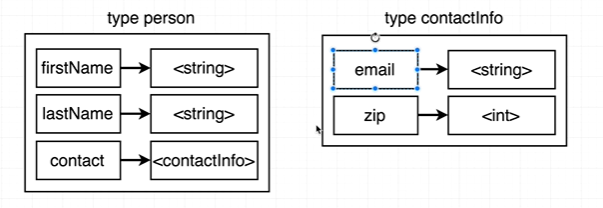
<br/>
Sample code: <br/>
```go
package main

import "fmt"

type contactInfo struct {
	email   string
	zipCode int
}

type person struct {
	firstName string
	lastName  string
	age       int
	contact   contactInfo
}

func main() {
	alex := person{
		firstName: "Alex",
		lastName:  "Anderson",
		contact: contactInfo{
			email:   "abc@test.com",
			zipCode: 123,
		},
		age: 20,
	}

	fmt.Printf("%+v\n", alex)
}
```

### Struct with Receiver Functions
([course link](https://www.udemy.com/course/go-the-complete-developers-guide/learn/lecture/7797342#overview)) <br/>

### Pass By Value
([course link](https://www.udemy.com/course/go-the-complete-developers-guide/learn/lecture/7797344#overview)) <br/>
Golang is a pass by value language. <br/>

<br/>

### Structs with Pointer
([course link](https://www.udemy.com/course/go-the-complete-developers-guide/learn/lecture/7797346#overview)) <br/>


### Pointer Operations
([course link](https://www.udemy.com/course/go-the-complete-developers-guide/learn/lecture/7797348#overview)) <br/>
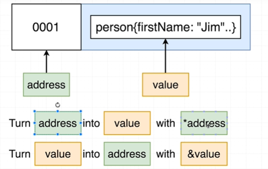
<br/>
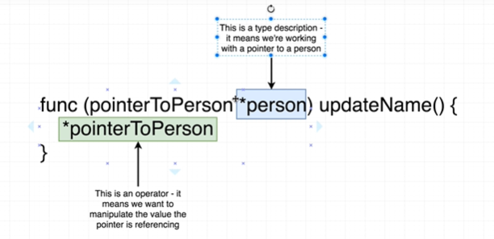
<br/>

### Pointer Shortcut
([course link](https://www.udemy.com/course/go-the-complete-developers-guide/learn/lecture/7797350#overview)) <br/>

<br/>

### Pointer Gotchas
([course link](https://www.udemy.com/course/go-the-complete-developers-guide/learn/lecture/7797352#overview)) <br/>

### Referece vs Value Types
([course link](https://www.udemy.com/course/go-the-complete-developers-guide/learn/lecture/7797354#overview)) <br/>
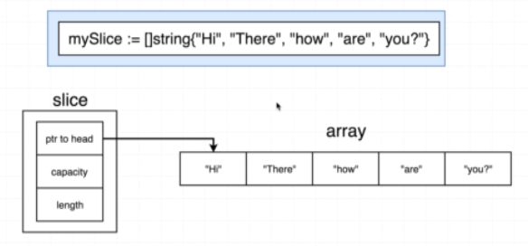
<br/>
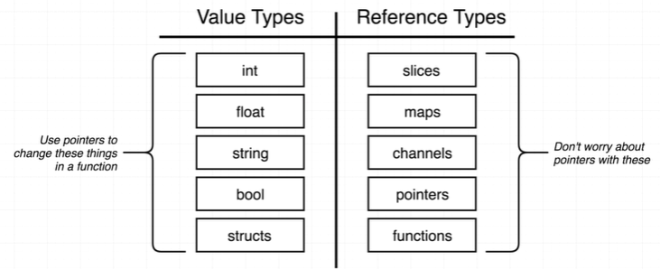
<br/>
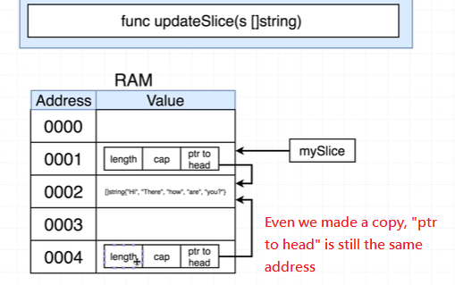
<br/>

<a id='s5'></a>
## Section5 - Maps

### What's a Map?
([course link](https://www.udemy.com/course/go-the-complete-developers-guide/learn/lecture/7797360#overview)) <br/>
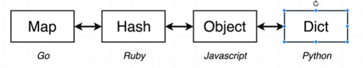
<br/>
* [A Tour of Go - Maps](https://tour.golang.org/moretypes/19)
* [Go by example: Maps](https://gobyexample.com/maps)
* [The Go Blog - Go maps in action](https://blog.golang.org/maps)

### Manipulating Maps
([course link](https://www.udemy.com/course/go-the-complete-developers-guide/learn/lecture/7797362#overview)) <br/>

### Iterating over Maps
([course link](https://www.udemy.com/course/go-the-complete-developers-guide/learn/lecture/7797366#overview)) <br/>
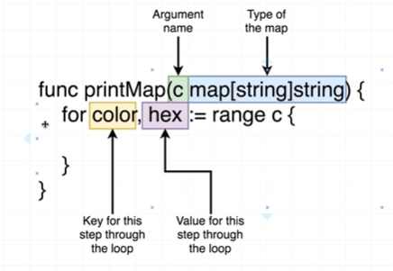
<br/>

### Differences between struct and map
([course link](https://www.udemy.com/course/go-the-complete-developers-guide/learn/lecture/7797370#overview)) <br/>
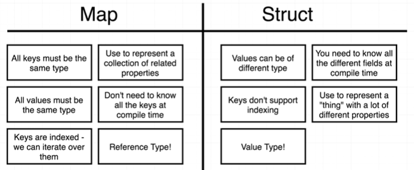
<br/>

<a id='s6'></a>
## Section6 - Interfaces
* [Go by Example: Interfaces](https://gobyexample.com/interfaces)
* [A Tour of Go - Interfaces](https://tour.golang.org/methods/9)
* [Tutorialspoint - Interfaces](https://www.tutorialspoint.com/go/go_interfaces.htm)

### Purpose of Interfaces
([course link](https://www.udemy.com/course/go-the-complete-developers-guide/learn/lecture/7797374#overview)) <br/>

<br/>

### Problmes Without Interfaces
([course link](https://www.udemy.com/course/go-the-complete-developers-guide/learn/lecture/7797376#overview)) <br/>
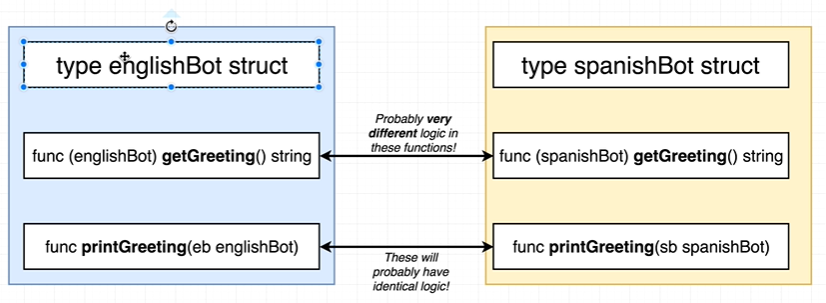
<br/>

### Interfaces in Practice
([course link](https://www.udemy.com/course/go-the-complete-developers-guide/learn/lecture/7797378#overview)) <br/>
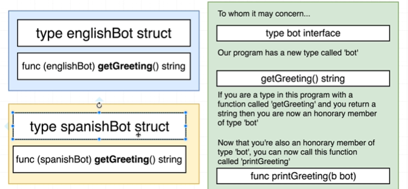
<br/>
Check [interfaces/main.go](src/interfaces/main.go) for the interface example of this course. <br/>

### Rules of Interfaces
([course link](https://www.udemy.com/course/go-the-complete-developers-guide/learn/lecture/7797380#overview)) <br/>
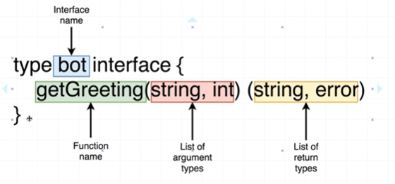
<br/>

### Extra Interface Notes
([course link](https://www.udemy.com/course/go-the-complete-developers-guide/learn/lecture/7797384#overview)) <br/>
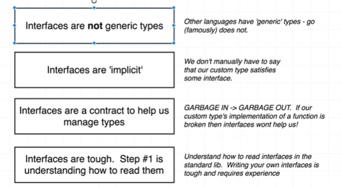
<br/>

### The HTTP Package
([course link](https://www.udemy.com/course/go-the-complete-developers-guide/learn/lecture/7797386#overview)) <br/>
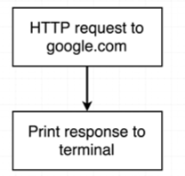
<br/>
Here we are going to use [golang package http](https://golang.org/pkg/net/http/) to do something so to learn more about interface. <br/>

### Reading the Docs
([course link](https://www.udemy.com/course/go-the-complete-developers-guide/learn/lecture/7797388#overview)) <br/>
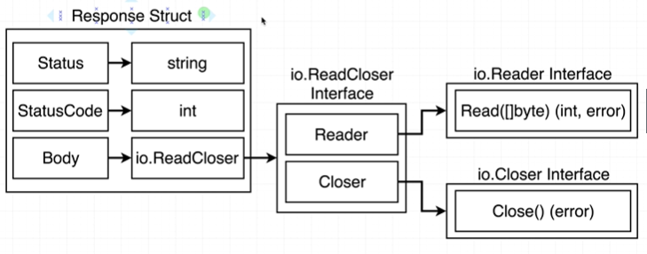
<br/>

### More Interface Syntax
([course link](https://www.udemy.com/course/go-the-complete-developers-guide/learn/lecture/7797392#overview)) <br/>

### Interface Review
([course link](https://www.udemy.com/course/go-the-complete-developers-guide/learn/lecture/7797394#overview)) <br/>

### The Reader Interface
([course link](https://www.udemy.com/course/go-the-complete-developers-guide/learn/lecture/7797396#overview)) <br/>
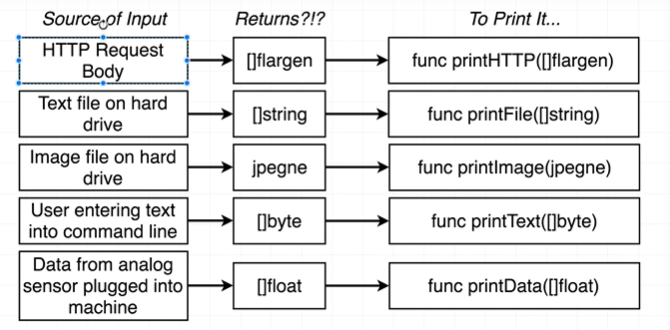
<br/>
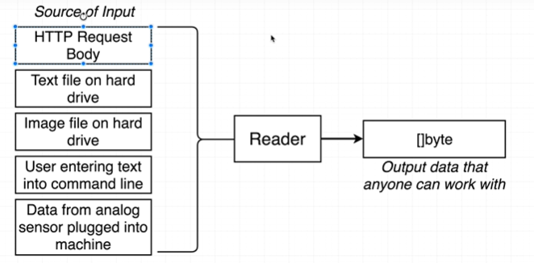
<br/>

### More on the Reader Interface
([course link](https://www.udemy.com/course/go-the-complete-developers-guide/learn/lecture/7797398#overview)) <br/>

## Supplement
* [A Tour of Go](https://tour.golang.org/welcome/1)
* [Tutorialspoint - Golang](https://www.tutorialspoint.com/go/index.htm)
* [Openhome - 語言技術：Go 語言](https://openhome.cc/Gossip/Go/)